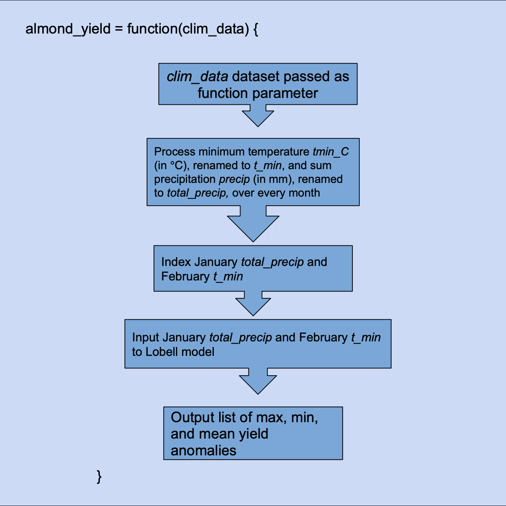

```{r setup, include=FALSE}
knitr::opts_chunk$set(echo = TRUE)
options(dplyr.summarise.inform = FALSE)
library(here)
library(dplyr)
library(knitr)
```



```{r}
#' Calculate the maximum, minimum, and mean almond yield anomaly for a given time series.
#' 
#' @param clim_data Data frame of daily climate data for time period of interest. Columns: day, month, year, wy, tmax_c, tmin_c, precip.
#' @returns List of max, min, and mean almond yield anomalies.
#'

almond_yield <- function(clim_data){
  #calculate monthly avg. for minimum and maximum temperatures and total precipitation per month
  clim_monthly <- clim_data %>%
    group_by(month, year) %>%
  summarize(tmin = min(tmin_c), total_precip = sum(precip))
  #index the months with the most determinant data for almonds and the respective data (precipitation in January and min. temperature in February)
  feb_tmin <- clim_monthly  %>% ungroup() %>% filter(month==2) %>% select(tmin)
  jan_precip <- clim_monthly  %>% ungroup() %>% filter(month==1) %>% select(total_precip)
  #create model using Lobell coefficients, minimum temperature in Feb and total precip in Jan
  almond_model <- -0.015*feb_tmin - 0.0046*feb_tmin^2 -.07*jan_precip + .0043*jan_precip^2 + .28
  #designate output as yield anomaly
  colnames(almond_model) <- "yield_anomaly"
  return(list(max_yield_anomaly = max(almond_model$yield_anomaly), min_yield_anomaly = min(almond_model$yield_anomaly), mean_yield_anomaly = mean(almond_model$yield_anomaly)))
}
#test function
clim_data <- as.data.frame(read.table(here("data","clim.txt"), header=T))
almond_yield(clim_data)
```

```{r}
#' Calculate the maximum, minimum, and mean almond yield anomaly for a given time series.
#' 
#' @param clim_data Data frame of daily climate data for time period of interest. Columns: day, month, year, wy, tmax_c, tmin_c, precip.
#' @returns List of max, min, and mean almond yield anomalies.
#' 

almond_yield <- function(clim_data) {
  
  # process climate data into monthly averages
  clim_monthly <- clim_data %>% 
    group_by(year, month) %>% 
    summarize(tmax = mean(tmax_c), tmin = min(tmin_c), total_precip = sum(precip))
  
  # get years of interest and loop through them
  years = unique(clim_monthly$year)
  yield_anomalies <- list()
  for(i in min(years):max(years)) {
    
    # filter data for each year
    year_i_data <- clim_monthly %>% 
      filter(year == i)
    
    # skip year if there's no data for the months needed
    if(!(1 %in% year_i_data$month) | !(2 %in% year_i_data$month)) {
      next
    }
    
    # extract needed values by referencing the row and column and input into formula
    yield_anomaly_i <- -0.015 * (year_i_data[year_i_data$month==2, ][[4]]) -
      0.0046 * (year_i_data[year_i_data$month==2, ][[4]])^2 -
      0.07 * (year_i_data[year_i_data$month==1, ][[5]]) +
      0.0043 * (year_i_data[year_i_data$month==1, ][[5]])^2 +
      0.28
    
    # add to list of anomalies
    yield_anomalies <- yield_anomalies %>% append(yield_anomaly_i)
  }
  
  # unlist anomalies and return max, min, and mean
  yield_anomalies <- unlist(yield_anomalies)
  return(list(max_yield_anomaly = max(yield_anomalies), min_yield_anomaly = min(yield_anomalies), mean_yield_anomaly = mean(yield_anomalies)))
}

clim_data <- as.data.frame(read.table(here("data","clim.txt"), header=T))

almond_yield(clim_data)
```
